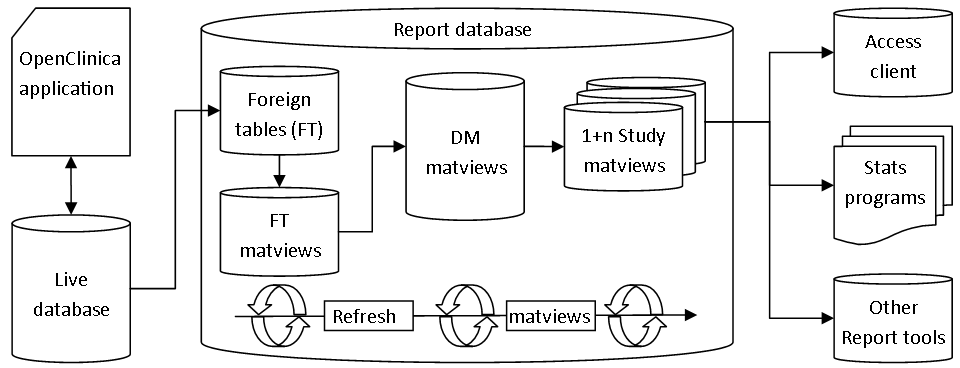

# Community Datamart
Lindsay Stevens
2016-10-03

# Topics
- Introductions
- Description / Features
- Demonstration of Basic setup
- Discussion of Advanced setup
- Client setup

# Introductions

## About Lindsay
- Education
  + BSc, Anatomy and Physiology
  + Working on Masters of Biostatistics
- University of Sydney: Cancer research
  + Project management ~ 4 years
  + Data systems ~ 1 year
- UNSW Australia: Hepatitis C research
  + Data systems ~ 3 years

## About the KI VHCRP
- Viral Hepatitis Clinical Research Program,
- VHCRP is part of the Kirby Institute, which is home to research specialists 
    in HIV, HCV and other infectious diseases,
- KI is part of the Faculty of Medicine at the University of New South Wales 
    (UNSW Australia)

# Datamart Description

## What is it
- A tool for simplifying OpenClinica data access for end users.
- A database system implemented in PostgreSQL, using SQL and PL/SQL
- Helper scripts for Stata or SAS study exports, and connecting MS Access.

## Why
- Smoother workflow:
    - For users writing study management reports in Access
    - For statisticians analysing data in Stata or SAS
- Data is pre-tabulated and includes commonly required metadata and queries.
- Data can be refreshed on a regular basis with minimal performance impact.

## How
- Datamart is a database application that connects to the OpenClinica database.
- Data is copied over to the report database and transformed.
- Scheduled task or pgAgent job scheduler performs data updates.

## Structure

## Design Considerations
- Study naming conventions:
    - PostgreSQL, SAS, and Stata have limits on variable name length.
    - Ideal is 12 characters or less, not starting with a number.
- Multi-select choices are exploded to columns, so:
    - Code values must only use valid identifier characters \[a-Z0-9\]
    - No anonymous / null / duplicate code value items.
- PostgreSQL column limit is about 1500:
    - Break up large item groups,
    - Consider impact of single-select and checkbox on final column count.

## Updates since OC15
- Stata snapshot function includes variable labelling commands
- Optional extension to Stata script to generate per-site XLSX snapshots
- Treat values containing only whitespace as NULL
- PostgreSQL 9.6 compatibility
- Documentation additions / improvements

## Planned Improvements
- Even more documentation
- Automated tests
- Facilities for automatically handling large item groups and invalid names.

# Setup

## Setup Types
- Basic: minimum required to build the report database for ad-hoc use.
- Advanced: guide for encrypted connections and Active Directory authentication.
- Maintenance: configuration of pgAgent to refresh the report database.

# Basic Setup

## Goals
- Minimal set up of the report database required for ad-hoc use.
- Data is processed but refresh / maintenance not defined.
- Database users created but authentication not defined.
- Possible to do it in the same PostgreSQL instance as the OpenClinica database.

## Steps
- In the OpenClinica database:
    - Create a role that has permissions to read all data.
    - Create a user that has the above role assigned.
- Enter all parameters into the setup script.
- Run the setup script.

## Demonstration
- Assumes PostgreSQL 9.3+ is already installed
- Uses the JUNO test / demo database provided by OpenClinica
- Runs the Stata export script.

# Advanced Setup

## Goals
- Secure connections
- Automated user management
- Performance optimisation
- Assumes separate VMs for OC / report but can be the same.

## Steps
- Configure OC server and OC datamart server certificates
- Configure database service user in Active Directory.
- Modify postgres general and authentication configurations.

# Client Setup

## Installation
- Minimum requirement: psqlODBC driver
- If using TLS: a copy of the OC datamart server certificate
- If slow DNS and using MS Access: modify "hosts", or use launcher script
    - Or patch psqlODBC to accept host / hostaddr
- Datamart creates users with study permissions that follow OpenClinica.

## Training
- Some generic slides included in the code repository.
- An introduction to SQL required, even with Access' query builder
- Probably some power users will emerge and develop reports.

## Example Uses
- Data entry and cleaning progress
- Identifying milestones for monitoring / data analysis
- Diagnostic information for participants based on clinical and lab database
- Loading adverse event data into report templates, MedDRA coding, etc.

