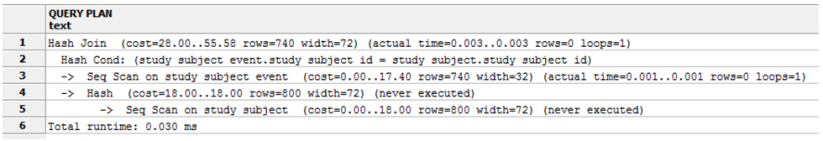

# Postgres is Awesome
Lindsay Stevens


## Topics
- Me
- A PostgreSQL Solution / long winded segue
- Query Optimisation
- Python in PostgreSQL


## Me


### Background
- Education
  + BSc, Anatomy and Physiology
  + Working on Masters of Biostatistics
- University of Sydney: Cancer research
  + Project management ~ 4 years
  + Data systems ~ 1 year
- UNSW Australia: Hepatitis C research
- Data systems ~ 2 years


### Research Data Systems
- Web app administration
  + OpenClinica: study data management (main data store)
  + Limesurvey: participant surveys
  + Django: public study info
  + LabKey: specimen management
- Other stuff
  + ODK: android app for clipboard-style surveys
  + Access/Excel: administrative data management
  + Python: glue between the various systems
  + Human proxy to Google Search


## A PostgreSQL Solution


### Problem
- OpenClinica data extract process
- User selects items to extract
  + XML job -> XLST job -> TSV, more XML, etc.
  + Post-processing usually required
  + User land: MS Office, Stata or SAS


### Problem (cont)
- Extract jobs can be slow (up to 30mins)
- Repetitive setup of post processing
- Files everywhere
  + Where is the data
  + Who has access to it
  + How complete / clean is it


### Solution
- Postgres datamart
  + Build / manage system: pgSQL/SQL functions
  + Connect to remote database: Foreign data wrapper
  + Cache data: Materialized views
  + Scheduled maintenance: pgAgent
  + User activity logging: postgresql.conf
  + Active Directory authentication: config - pg, hba, ident
  + Require client TLS connections: config - pg, hba
  + ODBC clients: psqlODBC


### Diagram

https://github.com/lindsay-stevens-kirby/openclinica_sqldatamart


### Example Schema


## Query Optimisation


### Problem 1 - OpenClinica Schemas


Each takes about 37 joins to fully reconstruct


### Problem 2 - System Constraints
- VM is Windows 2008R2 / 2CPU / 4GB / HDD
- Whole database is about 1GB
- Largest table (item values) ~ 500k rows
- Targets
  + Refresh all studies hourly
  + Update job complete in <15mins
    - Currently about 7mins


### Optimisation Strategies
- Query plans & settings
- Statistics & settings
- Indexing
- Memory settings
- Hints


### Query Plans
- How is the query being executed
- View plan by prepending command to SELECT
  + EXPLAIN: query plan estimates
  + EXPLAIN ANALYZE: estimate + actual
- Output Structure
  + Node type: table access method, join type
  + Node costs: in arbitrary units (affected by config)
  + Rows returned and their width (bytes)
  + Node specific info: filters, conditions, IO, etc.


### Query Plan Output


- FORMAT { TEXT | XML | JSON | YAML }
- github.com/depesz/explain.depesz.com
- pgAdmin gives you a nice graph


### Query Planner Settings
- Can be set global / session / transaction
- Toggle query operations e.g. nested loop joins
- Weight cost estimates e.g. favour seq_scan
- Toggle rewriting joins into FULL + WHERE


### Query Planner Settings (cont)
- Genetic Query Optimizer (geqo)
  + Alternative to default exhaustive search
  + Kicks in at 12 join items by default
  + Adjust join threshold or planning effort
  + Can randomly produce awful plans
- default_statistics_target
  + Amount of pages sampled for statistics
  + Can also be set by table or column


### Statistics
- What does the planner know about the data
- Refresh with ANALYZE (or by autovacuum)
- pg_catalog.pg_stat
  + *_all_indexes: index usage
  + *_all_tables: access (seq scan vs. index etc.)
  + *s: value stats - distinct, common, clustering


### Indexing
- Drop indexes
  + That are never used
  + On multi columns where only one column is hit
- Create indexes
  + Where queries hit a minority of rows
  + Using the same selectivity as WHERE / JOIN
  + Where values distinct count & variance >> 0
- Overhead: maintenance cpu / mem, disk space


### Memory
- Insufficient memory -> slower disk IO
- Memory defaults are very conservative
- About a dozen settings to consider
- Tuning for web apps != warehousing
- Some good resources:
  + Postgres wiki
  + github.com/gregs1104/pgtune
  + PostgreSQL High Performance books


### Hints
- Deconstruct the query to force join order
- Common Table Expressions
  + WITH alias AS (SELECT 1) SELECT * FROM alias
  + A neater way to lay out subqueries in general
  + CTEs can be referenced by other CTEs
- Temporary Tables
  + Indexable
  + Local to session


## Python in PostgreSQL


### PL/Python
- Postgres functions can be in many languages
  + SQL, pgSQL, C, TCL, Perl, Python, Python3, etc.
- Most are untrusted
  + Can do whatever the pg service role can do
  + Permission to execute functions is still role based
- Need to be enabled in the postgres build
  + Except for built-ins like plpgsql / plsql
- Per database CREATE EXTENSION pl...


### Environment
- Intepreter determined by PYTHONHOME
- Modify sys.path / site-packages for venv(-ish)
- Module import works based on sys.path
- Built-in dictionaries:
  + TD: transaction objects - new/old/ops/context
  + SD: function local storage
  + GD: global storage


### Import Caching Example
```plpgsql
CREATE OR REPLACE FUNCTION py_gimport()
  RETURNS void AS $body$
```
```python
""" cache pydoc.locate as GD["gimport"] """
if 'pydoc.locate' not in GD:
    from pydoc import locate
    GD['pydoc.locate'] = locate
def gimport(func_path):
    if func_path not in GD or GD[func_path] is None:
        GD[func_path] = GD['pydoc.locate'](func_path)
    return GD[func_path]
GD['gimport'] = gimport
```
```plpgsql
  $body$ LANGUAGE plpython3u;
```


### Hook up External Modules
- Implement and test functions externally
- Just add the function signature, import and return

```plpgsql
CREATE OR REPLACE FUNCTION py_max(a integer, b integer)
  RETURNS integer AS $body$
```
```python
pth = 'test_python_external.py_external.py_max'
py_max = GD['gimport'](pth)
return py_max(a, b)
```
```plpgsql
  $body$ LANGUAGE plpython3u;
```

```python
def pymax(a, b):
    max = a
    if a < b:
        max = b
    return max
```


### Why Bother
- Python more flexible than PL/pgSQL
- Save network overhead?
- Postgres as a platform?
  + Apache authe/sessions -> apache mods/pgtables
  + Controllers/autho -> pg tables/plpython functions
  + Use Postgres JSON/B to return data
  + Use Apache to return static UI JS
  + Parallel tasks: PL/Proxy (see http://goo.gl/pCV4Q)


## Gist of PL/Python code
The above code plus some other functions.

https://gist.github.com/lindsay-stevens-kirby/456bf4a6103d4fb966c0


## Thanks for listening
Questions / comments?

